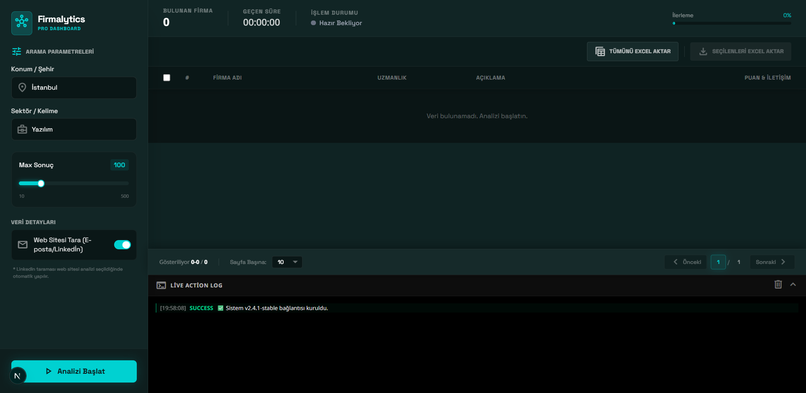

# 🚀 Firmalytics PRO


**Firmalytics PRO**, Google Maps üzerinden belirlediğiniz konum ve anahtar kelimelere göre işletmeleri tarayan, web sitelerini analiz ederek iletişim bilgilerini (E-posta, Telefon, LinkedIn) bulan ve verileri Excel formatında raporlayan gelişmiş bir veri madenciliği aracıdır.


*(Buraya projenin bir ekran görüntüsünü eklerseniz çok havalı durur)*

## ✨ Özellikler

- 🌍 **Google Maps Entegrasyonu:** Konum ve sektör bazlı sınırsız işletme taraması.
- ⚡ **Akıllı Scroll Sistemi:** Google Maps "Infinite Scroll" (Sonsuz Kaydırma) özelliğini simüle eden gelişmiş algoritma.
- 🔍 **Web Sitesi Analizi:** İşletmenin web sitesine girer, E-posta adreslerini ve sosyal medya linklerini (LinkedIn, Instagram vb.) otomatik bulur.
- 🚀 **Real-Time Takip:** Socket.io ile anlık işlem durumu, loglar ve ilerleme çubuğu.
- 📊 **Excel Dışa Aktarım:** Bulunan verileri tek tıkla `.xlsx` formatında indirme.
- 🎨 **Modern UI:** Tailwind CSS ile tasarlanmış, tamamen responsive "Dark Mode" arayüz.
- 🛡️ **Bot Koruması:** User-Agent rotasyonu ve insansı davranış simülasyonları.

## 🛠️ Teknolojiler

Bu proje aşağıdaki teknolojiler kullanılarak geliştirilmiştir:

- **Frontend:** [Next.js](https://nextjs.org/), [React](https://reactjs.org/), [Tailwind CSS](https://tailwindcss.com/)
- **Backend / API:** Next.js API Routes
- **Scraping:** [Puppeteer](https://pptr.dev/) (Browser Automation), [Cheerio](https://cheerio.js.org/) (HTML Parsing)
- **Real-Time:** [Socket.io](https://socket.io/)
- **Veri İşleme:** [SheetJS (xlsx)](https://sheetjs.com/)

## 📦 Kurulum

Projeyi yerel makinenizde çalıştırmak için aşağıdaki adımları izleyin:

1. **Repoyu klonlayın:**
   
   ```bash
   git clone https://github.com/KULLANICI_ADIN/firmalytics-pro.git
   cd firmalytics-pro
   ```

2. **Bağımlılıkları yükleyin:**
   
   ```bash
   npm install
   # veya
   yarn install
   ```

3. **Geliştirme sunucusunu başlatın:**
   
   ```bash
   npm run dev
   ```

4. Tarayıcınızda **`http://localhost:3000`** adresine gidin.

## 🚀 Kullanım

1. **Parametreleri Girin:** Sol panelden hedef konumu (Örn: "İstanbul") ve anahtar kelimeyi (Örn: "Yazılım Firmaları") girin.
2. **Ayarları Seçin:** Taranacak maksimum sonuç sayısını belirleyin. E-posta taraması istiyorsanız seçeneği aktif edin.
3. **Analizi Başlat:** "Analizi Başlat" butonuna basın.
4. **İzleyin:** Sağ taraftaki log panelinden ve tablodan verilerin akışını izleyin.
5. **Dışa Aktarın:** İşlem bittiğinde veya durdurduğunuzda sağ üstteki "Excel Aktar" butonunu kullanın.

## ⚠️ Yasal Uyarı

Bu proje yalnızca **eğitim ve araştırma amaçlı** geliştirilmiştir. Google Maps verilerini izinsiz ticari amaçla kullanmak veya sunucularını yormak Google'ın Hizmet Şartlarına aykırı olabilir. Kullanıcı, bu aracı kullanırken oluşabilecek yasal sorumlulukları kabul eder. Lütfen sorumlu bir şekilde kullanın.

## 🤝 Katkıda Bulunma

Katkılarınızı bekliyoruz! Bir sorun bulursanız "Issue" açabilir veya özellik eklemek için "Pull Request" gönderebilirsiniz.

1. Forklayın
2. Feature branch oluşturun (`git checkout -b feature/YeniOzellik`)
3. Commit atın (`git commit -m 'Yeni özellik eklendi'`)
4. Pushlayın (`git push origin feature/YeniOzellik`)
5. Pull Request açın

## 📄 Lisans

Bu proje [MIT Lisansı](LICENSE) ile lisanslanmıştır.

### Tavsiyeler:

1. **Ekran Görüntüsü:** Kodun çalıştığı anın (tablo dolu, loglar akarken) güzel bir ekran görüntüsünü alıp, repona yükle ve README içindeki görsel linkini güncelle. Görsel, GitHub projelerinde ilgiyi %100 artırır.
2. **Lisans Dosyası:** Repona `LICENSE` adında bir dosya ekleyip içine standart MIT lisans metnini yapıştırmayı unutma.
3. **İngilizce Versiyon:** Eğer global kullanıcılara hitap etmek istersen, README dosyasının altına bir de İngilizce versiyonunu ekleyebilirsin.
